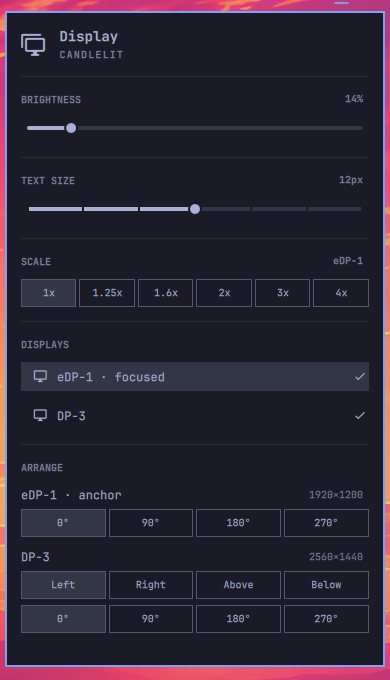
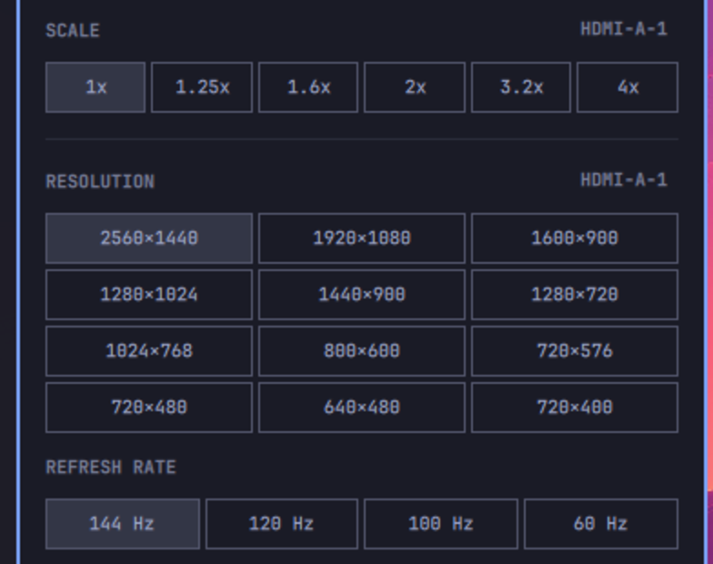

# Display arrange — placement, rotation, and mode picking in the Omarchy Display panel

A fork of Omarchy's stock `omarchy.monitor` (Display) bar widget that adds:

- **RESOLUTION** and **REFRESH RATE**, so you can take a 144 Hz monitor off the
  60 Hz mode it negotiated at boot without editing a config file
- **ARRANGE**, to put each display left / right / above / below your laptop
  panel and rotate any display 0° / 90° / 180° / 270°

All of it without opening `monitors.lua`.

Changes apply live *and* persist, so they survive `hyprctl reload` and logout.



## Resolution and refresh rate

Both target the focused display, the same way the stock SCALE row does, and
both list only what the display actually advertises. The section hides itself
on a panel with a single mode, since there is nothing there to pick.

Refresh rates are deduplicated to whole Hz, because a list offering both
"119.88 Hz" and "120.00 Hz" is noise. The faster exact value in each pair is
the one applied, so the 144 Hz pill really sets 143.98.

Picking a new resolution takes the fastest rate that resolution offers, which
is the choice you would have made by hand anyway.



A resolution change moves a display's edges, which would otherwise leave a gap
or an overlap in a multi-display arrangement. So after a mode change the
layout is re-seated: every display keeps the side of the anchor it was already
on, at its new size.

## Why relative placement instead of drag-and-drop

Displays are positioned on one shared coordinate grid, and the arithmetic
("this panel is 2560 wide, so the next one starts at 2560, and centre the
shorter one by half the difference") is the part worth automating. Four
buttons say what you mean — *put this one to the left* — and the plugin works
out the coordinates, including the axis swap when a display is rotated.

If you'd rather drag rectangles around a canvas, see the
[prior art](#prior-art) below; this is deliberately the lighter-weight take.

## How it works

One display is the **anchor** — the built-in laptop panel when there is one,
otherwise the first display. The anchor never moves, so the arrangement can't
drift away from the origin. Everything else is positioned relative to it, and
the whole layout is normalised back to `0x0` afterwards.

Each change is applied through `hyprctl eval` and then written to a managed
block in `~/.config/hypr/monitors.lua`:

```lua
-- >>> nvdk-display-layout: managed block, edited from the Display panel >>>
hl.monitor({ output = "eDP-1", mode = "1920x1200@60.00", position = "2560x120", scale = 1 })
hl.monitor({ output = "desc:Xiaomi Corporation Mi Monitor 6306110012120", mode = "2560x1440@99.95", position = "0x0", scale = 1 })
-- <<< nvdk-display-layout: managed block <<<
```

Only the text between the markers is rewritten. Your own `hl.monitor()` lines
go above the block and are left alone.

External displays are keyed by `desc:` (description plus serial, from EDID)
rather than by connector name, so a rule keeps applying when the same monitor
moves from DisplayPort to HDMI and comes back as a different output. The
internal panel is keyed by connector name, since it can never move.

### Note on `hyprctl keyword`

Omarchy configures Hyprland in Lua, and the Lua parser rejects `hyprctl
keyword` outright:

```
keyword can't work with non-legacy parsers. Use eval.
```

So this plugin uses `hyprctl eval 'hl.monitor({ ... })'` instead. Worth knowing
if you're writing anything similar — the stock panel's monitor toggle still
uses `keyword` and silently no-ops (basecamp/omarchy#6968, fixed by the open
PR basecamp/omarchy#8728).

## Install

```bash
git clone https://github.com/xe-nvdk/omarchy-display-arrange.git \
  ~/.config/omarchy/plugins/nvdk.monitor
install -Dm755 ~/.config/omarchy/plugins/nvdk.monitor/bin/nvdk-display-layout \
  ~/.local/bin/nvdk-display-layout
omarchy plugin enable nvdk.monitor
omarchy restart shell
```

Then open the panel with **SUPER+CTRL+D**, or click the display icon in the bar.

`~/.local/bin` needs to be on your `PATH` — the panel shells out to
`nvdk-display-layout` for every action.

> **`omarchy restart shell` is required after any edit to the plugin's QML.**
> The shell logs `Local plugin changed, reloading:` and re-reads the file, but
> keeps the old panel instance alive, so edits appear to do nothing.

## CLI

The panel is a thin front-end; everything is also usable directly:

```bash
nvdk-display-layout state                          # rich JSON: geometry, transform, logical size
nvdk-display-layout place  DP-3 left eDP-1         # left | right | above | below
nvdk-display-layout rotate DP-3 90                 # 0 | 90 | 180 | 270
nvdk-display-layout mode   DP-3 2560x1440@100      # resolution and refresh rate
nvdk-display-layout persist                        # snapshot live layout into monitors.lua
```

Targets match on connector name first, then on description.

`mode` snaps the rate to the closest one the display advertises at that
resolution, so `2560x1440@144` finds the real 143.98 Hz mode rather than
failing on the two-hundredths it was off by. `state` reports each display's
full mode list, which is what the panel builds its pills from.

## Known limitations

- **ARRANGE is mouse only.** The panel's keyboard cursor is a one-dimensional
  section walker; wiring a per-display grid into it risked breaking the
  existing navigation, so the ARRANGE controls aren't reachable by keyboard
  yet. RESOLUTION and REFRESH RATE are: `j`/`k` steps between sections, `h`/`l`
  walks the pills, `Enter` applies.
- **One anchor.** With three or more displays you can't place two on the same
  side of the anchor.
- **Clamshell mode fights it.** While docked, the clamshell watcher re-applies
  `position = "auto"` to the internal panel every ~2s and ignores `desc:` rules
  (basecamp/omarchy#7326, basecamp/omarchy#7084 — open PR
  basecamp/omarchy#8808 addresses the parser side).

## Prior art

Two other people have built display-positioning plugins for the Omarchy shell,
both drag-and-drop:

- [omarchy-display-manager](https://github.com/Azteriisk/omarchy-display-manager)
  by Azteriisk — interactive drag-and-drop canvas with magnetic snapping
  ([discussion #8853](https://github.com/basecamp/omarchy/discussions/8853))
- Omarchy Display Order — drag-and-drop monitor ordering
  ([discussion #8494](https://github.com/basecamp/omarchy/discussions/8494))

Neither offers rotation, which is the other half of what this adds.

## Licence

MIT. Forked from Omarchy's `shell/plugins/panels/monitor`, which is part of
[Omarchy](https://github.com/basecamp/omarchy).
